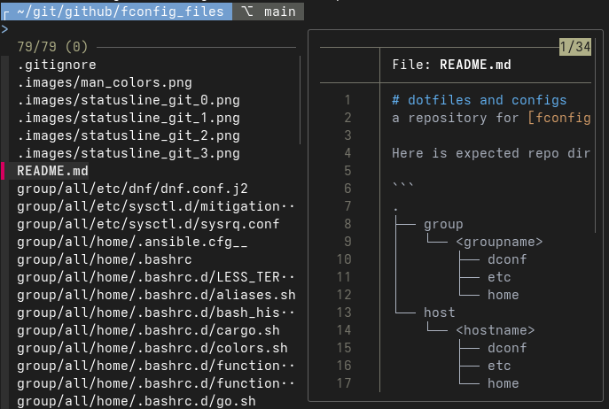
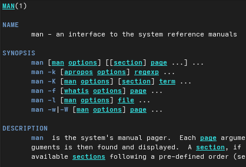

# dotfiles and configs
a repository for [fconfig](https://github.com/goloshubov/fconfig)

Here is expected repo directory structure

```
.
├── group
│   └── <groupname>
│       ├── dconf
│       ├── etc
│       └── home
└── host
    └── <hostname>
        ├── dconf
        ├── etc
        └── home
```

## some features
- .bashrc.d/*
  - [statusline](group/workstations/home/.bashrc.d/z99_statusline.sh) (powerline-like custom bash prompt)\
    \
    \
    \
    
  - [fzf](group/workstations/home/.bashrc.d/fzf.sh) - advanced search tool, Ctrl-R replacement, quick file browser (for terminal, vim):\
    
  - custom [colors](group/all/home/.bashrc.d/LESS_TERMCAP.sh) (man)\
    
- etc ...
